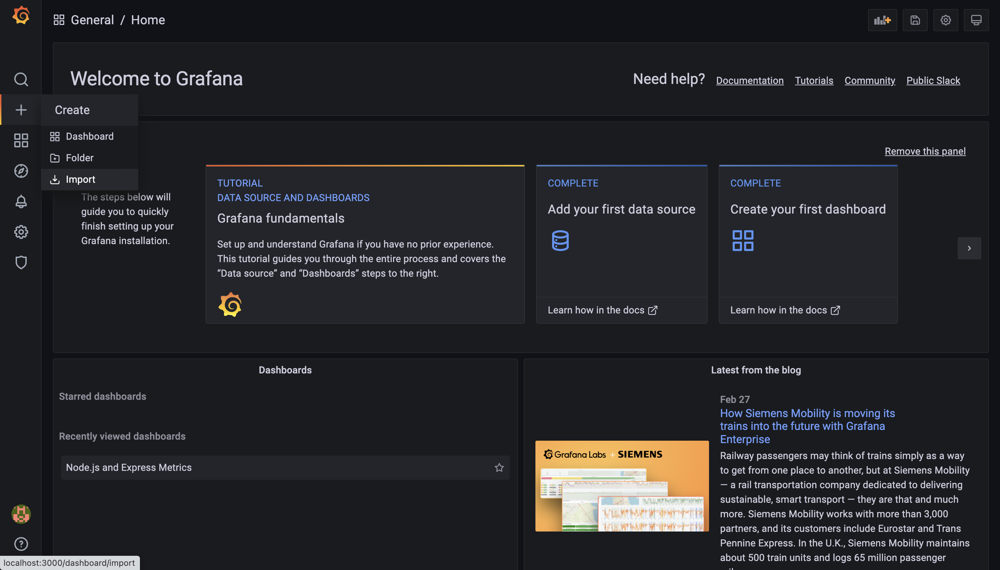

# Example Monitoring Infrastructure

This repository contains basic express application with monitoring infrastructure.

I use the following software for the monitoring infrastructure:
- Grafana (Data Visualization)
- Loki (Data Source for Logs)
- Prometheus (Data Source for about Anything)

## How to run it?

It's simple, just run the script on the `deploy` folder.

```sh
./deploy/deploy.sh --start
```

To stop it:

```sh
./deploy/deploy.sh --stop
```

## Grafana Dashboard

When you run it, it's not done yet, you have to setup the Dashboard on Grafana.

### Node.js and Express Metrics

Since, I'm using express.js, I added [Express Prometheus Middleware](https://www.npmjs.com/package/express-prometheus-middleware)
on my express routes.

Then, it will automatically adds Histogram and endpoints to retrieve that metrics.

When you're set, go to Grafana, and add Prometheus as data source.


Then, after that, you can import dashboard, and copy the JSON definition from [here](https://grafana.com/api/dashboards/14565/revisions/1/download).



You're done.

### Logging

I use loki for logging. So, set Loki as the datasource, and get done with it.


